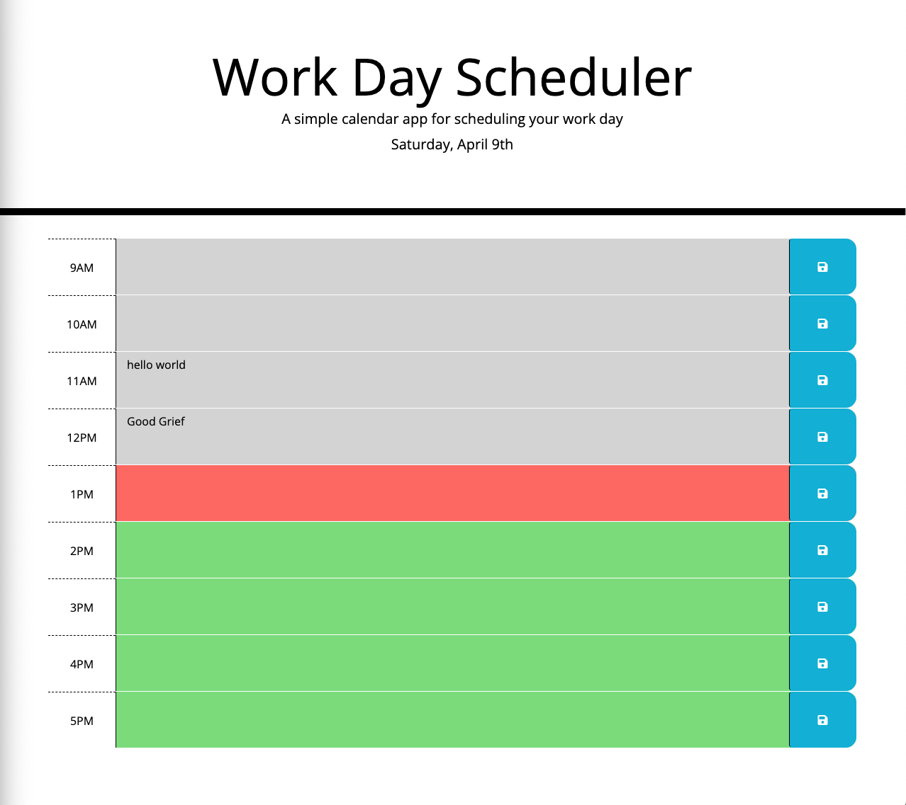

# Calendar

Created by Christopher Borer
April 9th 2022

A daily planner that shows the current day, the time of the day from 9am to 5pm and allow you to enter and save activites. 

1. The current day is displayed at the top of the calendar
2. time blocks are displayed for standard business hours
3. Each time block is color-coded to indicate whether it is in the past, present, or future
4. Clicking into a time block opens the text box for entering data.
5. the data is saved to local storage by clicking the save button for that time block
6. Reloading the page show the items are still there.

github link to the final version of code.
This site was built using [GitHub Pages](https://github.com/cspower5/Calendar).

